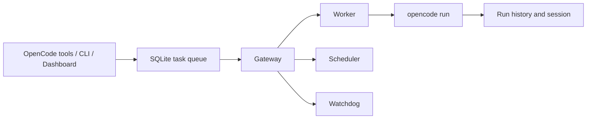

# SuperTask

<p align="center"><strong>Queue it. Schedule it. Retry it. Know what happened.</strong></p>

<p align="center">
  <a href="https://www.npmjs.com/package/opencode-supertask"></a>
  <a href="https://github.com/vbgate/opencode-supertask/actions/workflows/ci.yml"></a>
  <a href="https://opensource.org/licenses/MIT"></a>
</p>

<p align="center">
  <strong>English</strong> | <a href="https://github.com/vbgate/opencode-supertask/blob/main/README.zh-CN.md">简体中文</a>
</p>

SuperTask turns one-off `opencode run` commands into durable Agent operations. It gives OpenCode agents a persistent SQLite queue, scheduling, retries, concurrency control, safe cancellation, execution history, explicit human handoff into Herdr, and a local Web Dashboard.

OpenCode can run an Agent now. SuperTask makes sure the work is still tracked after the terminal closes, the process fails, or the machine restarts.

## Why SuperTask?

| If you need to... | Use |
| --- | --- |
| Run one Agent once | `opencode run` |
| Run a few fixed commands at fixed times | `cron`, `launchd`, `systemd`, or GitHub Actions |
| Restart a long-running process on a schedule | PM2 `cron_restart` |
| Manage changing Agent jobs with durable state, retries, priorities, and history | **SuperTask** |

SuperTask is not another wrapper around cron. Scheduled work becomes an ordinary durable queue task, so manual and scheduled jobs follow the same concurrency, retry, cancellation, dependency, and history rules.

## What You Get

| Capability | What it means |
| --- | --- |
| Durable queue | Tasks and every run survive process and machine restarts in SQLite WAL |
| Three schedule types | Cron, run-once delay, and fixed recurring interval |
| Automatic recovery | Retry budgets, exponential backoff, dead-letter state, and manual retry |
| Controlled execution | Global concurrency, priority ordering, dependencies, and global batch serialization |
| Project awareness | Each task keeps its OpenCode project directory, Agent, model, and optional model variant |
| Safe process handling | Cancel and shutdown wait for the managed OpenCode Unix process group to drain |
| Observable runs | Session ID, exact reproducible command, model output, tools, errors, and raw JSONL |
| Local Dashboard | Create, schedule, inspect, retry, cancel, and diagnose from `127.0.0.1` |

## Three-Minute Quick Start

### 1. Install one exact version

```bash
VERSION="$(npm view opencode-supertask dist-tags.latest)"
npm install -g "opencode-supertask@$VERSION"
opencode plugin "opencode-supertask@$VERSION" --global --force
```

Pinning the exact version keeps the OpenCode plugin, global CLI, and Gateway on the same build. Do not replace it with a bare package name or `@latest` in `opencode.json`.

### 2. Restart OpenCode and start the Gateway

```bash
supertask install   # recommended: PM2 startup, crash recovery, and log rotation
```

For foreground development instead:

```bash
supertask gateway
```

The plugin never installs global services during OpenCode startup. PM2 setup only happens when you explicitly run `supertask install`.

### 3. Ask OpenCode to create a task

```text
Create a SuperTask named "Review API errors".
Use the build agent in this project, retry twice, and run it now.
```

OpenCode receives eight native `supertask_*` plugin tools. The current project directory is taken from OpenCode's tool context rather than trusted from model input.

### 4. Watch it run

```bash
supertask status
supertask list --limit 10
supertask ui
```

The Dashboard opens at <http://127.0.0.1:4680>.

## How It Works



The single Gateway owns runtime state transitions. Clients create and manage work; only the Gateway marks runs started, completed, failed, retried, or cancelled.

## Use It Your Way

### Natural language in OpenCode

```text
Run a security review with agent build, model provider/model, and variant high.

Every weekday at 9:00, create a report task for this project.

Show failed tasks in this project and retry the recoverable ones.

Check whether batch "release" is running in another project.
```

Available plugin tools:

```text
supertask_add       supertask_schedule  supertask_status   supertask_retry
supertask_list      supertask_get       supertask_next     supertask_upgrade
```

### CLI

```bash
# Queue work
supertask add --name "Security review" --agent build \
  --model openai/gpt-5.6-sol --variant xhigh \
  --prompt "Review authentication and authorization" \
  --importance 5 --urgency 4 --max-retries 2 \
  --retry-backoff 30s --timeout 30min

# Schedule work
supertask template add --name "Weekday report" --agent build \
  --model openai/gpt-5.6-sol --variant high \
  --prompt "Summarize important project changes" \
  --type cron --cron "0 9 * * 1-5"

# Inspect and recover
supertask status
supertask list --status failed --limit 20
supertask retry --id 42
supertask cancel --id 42
```

Run `supertask --help` or `supertask <command> --help` for the complete command surface. CLI help and human-readable diagnostics support `auto`, `en`, and `zh-CN`.

## Dashboard

The responsive Dashboard supports English and Chinese, light and dark themes, and four focused views:

| Page | Purpose |
| --- | --- |
| Task Queue | Browse projects, create/edit tasks, see priorities and active state, retry, cancel, or delete safely |
| Scheduled Tasks | Create/edit cron, delayed, and recurring templates; run one immediately without bypassing the queue |
| Execution Logs | Read structured output, tools, errors, sessions, and the exact historical command |
| System Status | Inspect active configuration, health, concurrency, and backup-first database maintenance |

The project picker reads the selected directory's Agent and model catalogs through the OpenCode 2 client, so forms offer only locally available models, each model's declared variants, and directly runnable Agents. A non-default variant is passed as `model#variant`; leaving it at default follows the Agent/model configuration.

When `handoff.enabled` is configured, a managed Agent can explicitly call `supertask_handoff`. SuperTask preserves its OpenCode session, marks the run **Awaiting Will**, opens a persistent tab in the dedicated Herdr workspace, and resumes the same session in the OpenCode 2 TUI. The task completes when that TUI exits normally.

## Reliability Without Hand-Waving

- SQLite `BEGIN IMMEDIATE` protects the single-Gateway lock and global batch serialization.
- Candidate selection and the `running` transition happen in one immediate transaction, so concurrent edits cannot alter a claimed task.
- Each managed run has a unique launcher identity and an isolated Unix process group.
- A run settles only after the launcher proves the entire process group drained.
- Process containment ends at that group: descendants that deliberately call `setsid()` or start as detached daemons must manage their own lifecycle.
- Shutdown and cancellation fail closed when process ownership cannot be proven.
- `supertask doctor` verifies OpenCode, the effective pinned plugin, cache, CLI, Gateway package, ready lock, SQLite, Dashboard, and PM2 environment.
- Database clear and restore are transactional, backup-first, WAL-consistent, and reject active work.

The detailed guarantees and recovery rules live in [Architecture](docs/architecture.md) and [Operations and Troubleshooting](docs/operations.md).

## Upgrade and Diagnose

```bash
supertask upgrade          # update only when versions or components have drifted
supertask upgrade --force  # reinstall the current version, refresh environment, restart
supertask doctor
supertask doctor --smoke --smoke-agent build --smoke-model provider/model --smoke-variant high
```

When every component already matches npm `latest`, normal upgrade is a no-op and does not restart the Gateway. Smoke diagnostics make one real model call; ordinary `doctor` does not.

## Requirements

- OpenCode
- Bun 1.1.45 or newer
- Node.js/npm for the documented install and upgrade flow
- macOS or Linux for Gateway task execution

Windows Worker execution remains disabled until OS Job Object containment can provide equivalent managed-process isolation and a recoverable drain proof. Queue execution does not require PM2 when the Gateway runs in the foreground.

## Install From Source

```bash
git clone https://github.com/vbgate/opencode-supertask.git
cd opencode-supertask
bun install
bun run build
```

Point OpenCode at the built plugin file:

```json
{
  "plugin": [
    "file:///home/user/src/opencode-supertask/dist/plugin/supertask.js"
  ]
}
```

Then restart OpenCode and run `bun run gateway` from the repository.

## AI-Friendly by Design

- Tool descriptions include scheduling, retries, global batches, dependencies, and project-scope semantics.
- Plugin tools use the OpenCode context directory and reject a model-supplied working directory.
- Task-management commands return JSON, while database and doctor commands support explicit `--json`; interactive summaries are concise and localized.
- `AGENTS.md` records architecture invariants, testing rules, release rules, and unsafe shortcuts for coding agents.
- Commands record the exact executable, arguments, model, variant, Agent, and working directory for reproducible diagnosis.

## Documentation

- [Operations and troubleshooting](docs/operations.md)
- [Current architecture and decisions](docs/architecture.md)
- [Changelog](CHANGELOG.md)
- [Documentation index](docs/README.md)
- [Contributor and Agent rules](AGENTS.md)

## Development

```bash
bun install --frozen-lockfile
bun test
bun run typecheck
bun run typecheck:tests
bun run lint
bun run test:coverage
bun run test:browser
bun run build
bun run package:smoke
```

CI runs the suite on Linux and macOS, exercises the real Dashboard in Chromium, installs the packed npm artifact, and runs representative built-product tests on the minimum supported Bun version.

## License

MIT
