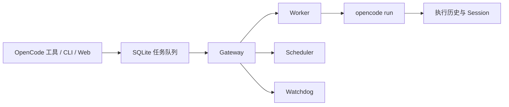

# SuperTask

<p align="center"><strong>排得上、定得准、失败能重试、执行有记录。</strong></p>

<p align="center">
  <a href="https://www.npmjs.com/package/opencode-supertask"></a>
  <a href="https://github.com/vbgate/opencode-supertask/actions/workflows/ci.yml"></a>
  <a href="https://opensource.org/licenses/MIT"></a>
</p>

<p align="center">
  <a href="https://github.com/vbgate/opencode-supertask#readme">English</a> | <strong>简体中文</strong>
</p>

SuperTask 把一次性的 `opencode run` 变成可持续运行的 Agent 工作系统：持久化任务队列、定时调度、自动重试、并发控制、安全取消、执行历史和本地 Web 控制台，一套全有。

OpenCode 能立刻运行一个 Agent；SuperTask 负责在终端关闭、进程失败或机器重启之后，仍然知道任务在哪、跑了几次、为什么失败、该不该重试。

## 为什么需要 SuperTask？

| 你的需求 | 更合适的工具 |
| --- | --- |
| 立即运行一次 Agent | `opencode run` |
| 固定时间运行少量固定命令 | `cron`、`launchd`、`systemd` 或 GitHub Actions |
| 定时重启一个长期进程 | PM2 `cron_restart` |
| 管理不断变化、需要状态、重试、优先级和历史的 Agent 任务 | **SuperTask** |

SuperTask 不是给 cron 套一层壳。定时器生成的也是普通持久任务，所以手动任务与定时任务共用并发、重试、取消、依赖和历史记录规则。

## 你会得到什么

| 能力 | 实际价值 |
| --- | --- |
| 持久任务队列 | 任务及每次执行写入 SQLite WAL，进程或机器重启后仍在 |
| 三种定时方式 | Cron、延迟执行一次、固定间隔循环 |
| 自动恢复 | 重试预算、指数退避、停止重试状态和人工恢复 |
| 可控执行 | 全局并发、优先级、依赖关系和全局同批次串行 |
| 项目感知 | 每个任务保留 OpenCode 项目目录、Agent、模型和可选模型 variant |
| 安全进程管理 | 取消或停机时等待受管 OpenCode Unix 进程组排空 |
| 可观测执行 | Session、真实命令、模型输出、工具、错误和原始 JSONL |
| 本地控制台 | 在 `127.0.0.1` 创建、定时、查看、重试、取消和诊断 |

## 三分钟开始使用

### 1. 安装同一个精确版本

```bash
VERSION="$(npm view opencode-supertask dist-tags.latest)"
npm install -g "opencode-supertask@$VERSION"
opencode plugin "opencode-supertask@$VERSION" --global --force
```

固定精确版本可以保证 OpenCode 插件、全局 CLI 和 Gateway 使用同一份构建。不要在 `opencode.json` 中改成裸包名或 `@latest`。

### 2. 重启 OpenCode，再启动 Gateway

```bash
supertask install   # 推荐：PM2 开机启动、崩溃恢复和日志轮转
```

开发时也可以前台运行：

```bash
supertask gateway
```

插件不会在 OpenCode 启动时静默安装全局服务。只有显式运行 `supertask install` 才会配置 PM2。

### 3. 直接让 OpenCode 创建任务

```text
创建一个名为“检查 API 错误”的 SuperTask。
使用当前项目的 build Agent，失败重试两次，现在执行。
```

OpenCode 会获得 8 个原生 `supertask_*` 插件工具。任务目录来自 OpenCode 工具上下文，不信任模型自行传入的工作目录。

### 4. 看着它跑完

```bash
supertask status
supertask list --limit 10
supertask ui
```

控制台地址：<http://127.0.0.1:4680>。

## 工作原理



单实例 Gateway 独占运行状态迁移。客户端负责创建和管理任务，只有 Gateway 能把执行记录标记为开始、完成、失败、重试或取消。

## 多种使用方式

### 在 OpenCode 中说自然语言

```text
用 build Agent、provider/model 模型和 high variant 执行一次安全审查。

每个工作日上午 9 点，为当前项目创建一条汇报任务。

列出当前项目失败的任务，重试其中可以恢复的任务。

检查 release 批次是否正在其他项目中运行。
```

可用插件工具：

```text
supertask_add       supertask_schedule  supertask_status   supertask_retry
supertask_list      supertask_get       supertask_next     supertask_upgrade
```

### 使用 CLI

```bash
# 创建任务
supertask add --name "安全审查" --agent build \
  --model openai/gpt-5.6-sol --variant xhigh \
  --prompt "检查认证与授权实现" \
  --importance 5 --urgency 4 --max-retries 2 \
  --retry-backoff 30s --timeout 30min

# 创建定时任务
supertask template add --name "工作日汇报" --agent build \
  --model openai/gpt-5.6-sol --variant high \
  --prompt "汇总项目的重要变化" \
  --type cron --cron "0 9 * * 1-5"

# 查看与恢复
supertask status
supertask list --status failed --limit 20
supertask retry --id 42
supertask cancel --id 42
```

运行 `supertask --help` 或 `supertask <命令> --help` 查看完整参数。CLI 帮助和人类可读诊断支持 `auto`、`zh-CN` 和 `en`。

## Web 控制台

响应式 Dashboard 支持中英文、深浅主题，包含四个聚焦页面：

| 页面 | 用途 |
| --- | --- |
| 任务队列 | 浏览项目、创建和编辑任务、查看优先级和运行状态、安全重试、取消或删除 |
| 定时任务 | 创建和编辑 cron、延迟、循环模板；“立即运行”仍然进入统一队列 |
| 执行记录 | 查看结构化输出、工具、错误、Session 和历史真实命令 |
| 系统状态 | 检查生效配置、健康状态、并发，以及先备份后维护数据库 |

项目选择器会通过 OpenCode 2 Client 按目标目录读取 Agent 和模型目录，表单只展示本机可用模型、各模型声明的 variants 和可以直接运行的 Agent。非默认 variant 会按 `model#variant` 传递；留在默认值时继续跟随 Agent/模型配置。

## 可靠不是一句口号

- SQLite `BEGIN IMMEDIATE` 保护单 Gateway 锁和全局批次串行。
- 候选筛选与 `running` 转换在同一个即时事务完成，并发编辑无法改写已经抢占的任务。
- 每次执行都有唯一 launcher 身份和独立 Unix 进程组。
- launcher 证明整组进程排空后，任务才会结算。
- 进程隔离边界止于该组；主动调用 `setsid()` 或以 detached daemon 方式离组的后代必须自行管理生命周期。
- 无法证明进程归属时，取消和停机保持保守，不误杀、不重复跑。
- `supertask doctor` 检查 OpenCode、精确插件、缓存、CLI、Gateway 包、ready 锁、SQLite、Dashboard 和 PM2 环境。
- 数据库清空和恢复采用事务、先备份、包含 WAL 一致数据，并拒绝运行中任务。

详细保证与恢复规则见[当前架构](docs/architecture.md)和[运行与排障手册](docs/operations.md)。

## 升级与诊断

```bash
supertask upgrade          # 仅在版本或组件漂移时更新
supertask upgrade --force  # 同版本重装、刷新环境并重启
supertask doctor
supertask doctor --smoke --smoke-agent build --smoke-model provider/model --smoke-variant high
```

所有组件已经匹配 npm `latest` 时，普通升级直接返回，不重启 Gateway。`doctor --smoke` 会产生一次真实模型调用，普通 `doctor` 不调用模型。

## 运行要求

- OpenCode
- Bun 1.1.45 或更高版本
- 按本文方式安装和升级需要 Node.js/npm
- Gateway 任务执行当前支持 macOS 和 Linux

Windows Worker 在 Job Object 能提供等价的受管进程隔离与可恢复排空证明前保持禁用。前台运行 Gateway 时不依赖 PM2。

## 从源码安装

```bash
git clone https://github.com/vbgate/opencode-supertask.git
cd opencode-supertask
bun install
bun run build
```

让 OpenCode 直接加载构建后的插件文件：

```json
{
  "plugin": [
    "file:///home/user/src/opencode-supertask/dist/plugin/supertask.js"
  ]
}
```

重启 OpenCode，然后在仓库目录执行 `bun run gateway`。

## 对 AI 友好的设计

- 工具描述包含定时、重试、全局批次、依赖和项目作用域语义。
- 插件工具使用 OpenCode 上下文目录，拒绝模型伪造工作目录。
- 任务管理命令返回 JSON，数据库与 doctor 命令支持显式 `--json`；交互摘要保持简洁并支持中英文。
- `AGENTS.md` 为编码 Agent 记录架构不变量、测试规则、发布流程和禁止的危险捷径。
- 每次执行记录真实 executable、参数、模型、variant、Agent 和工作目录，方便 AI 精确复现和诊断。

## 文档

- [运行与排障手册](docs/operations.md)
- [当前架构与决策](docs/architecture.md)
- [更新记录](CHANGELOG.md)
- [文档索引](docs/README.md)
- [贡献者与 Agent 规则](AGENTS.md)

## 开发

```bash
bun install --frozen-lockfile
bun test
bun run typecheck
bun run typecheck:tests
bun run lint
bun run test:coverage
bun run test:browser
bun run build
bun run package:smoke
```

CI 在 Linux 和 macOS 运行测试，用真实 Chromium 执行 Dashboard 冒烟验证，隔离安装 npm 打包产物，并在最低支持 Bun 版本运行代表性的构建产物测试。

## 许可证

MIT
